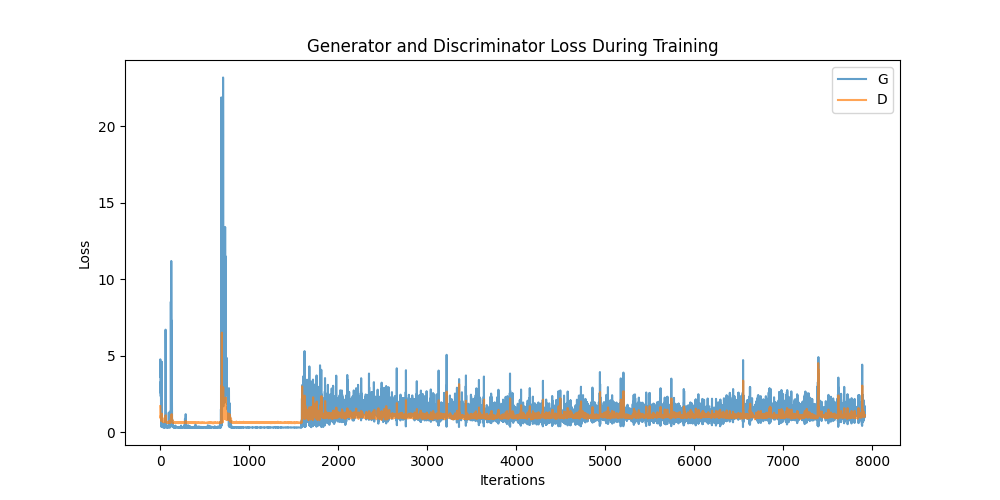
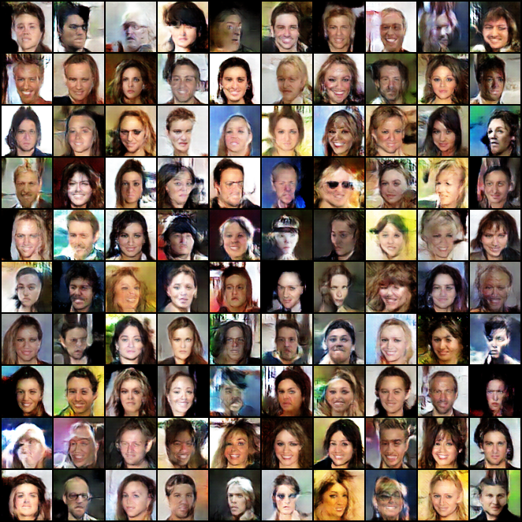
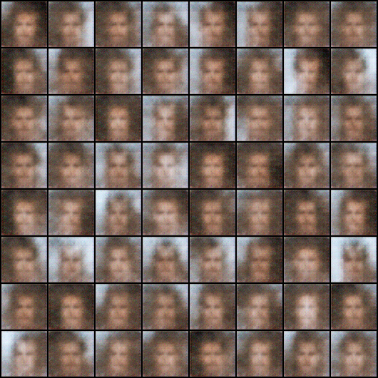
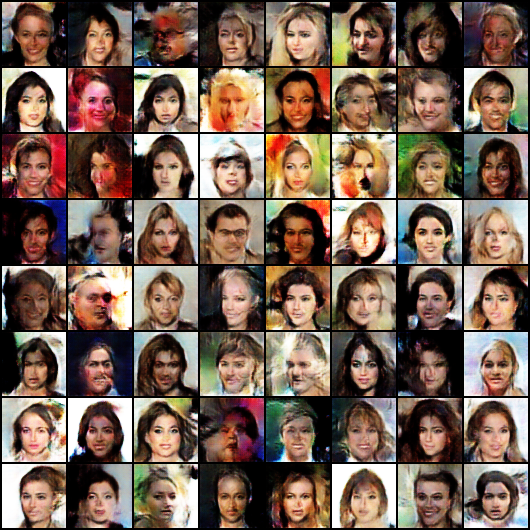
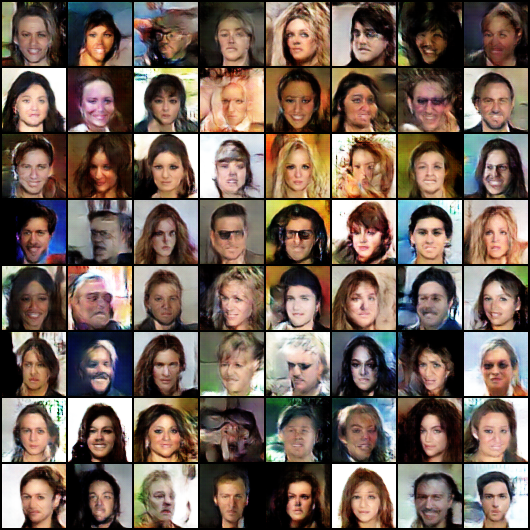
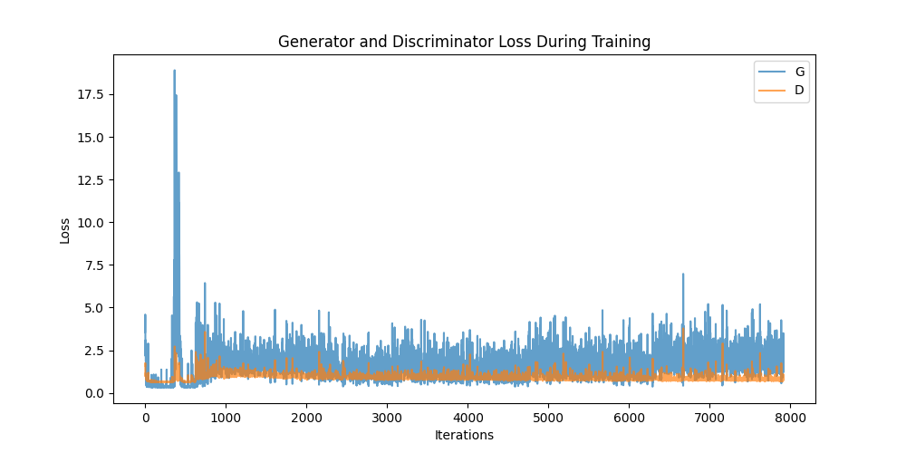
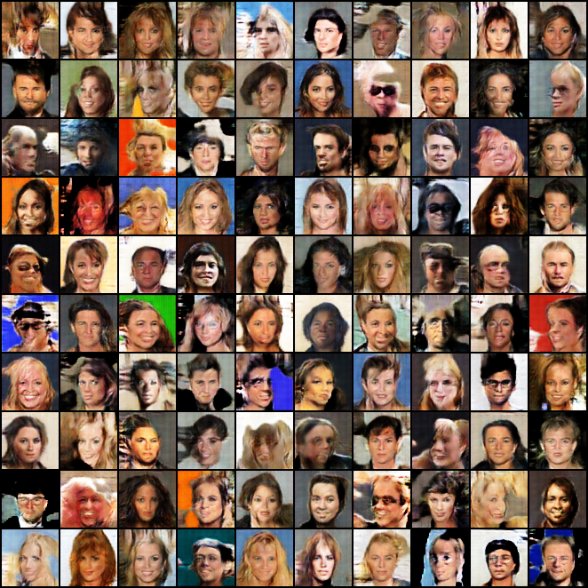
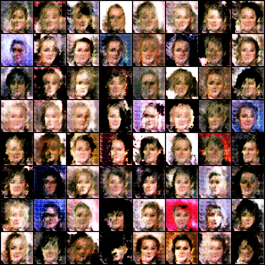
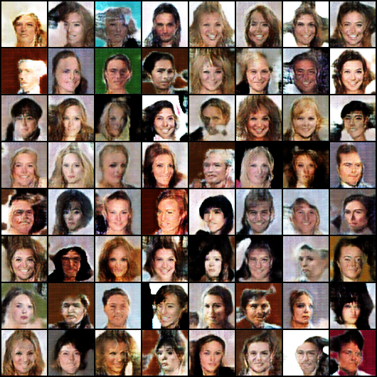
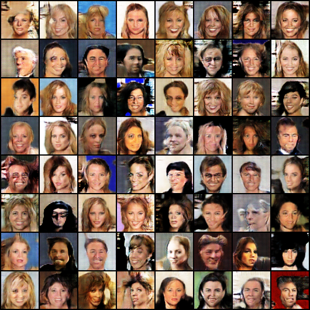

# Gan de Fabien ETHEVE  

### Architecture

```
C:.
├───checkpoints # les checkpoints de l'entrainement
├───dataset # le datasets d'entrainement
│   └───img_align_celeba
│       └───img_align_celeba
├───generated_images # les images générés de l'entrainement avec attention
├───generated_images_witou_attention # les résultats d'entrainemenet sans attention
├───model # les différents modeles 
│   ├───attention
│   ├───discriminator
│   └───generator
└───utils # les utilitaires comme le data loader

```
Nous avons aussi deux fichiers : 

train.py : qui va nous permettre de lancer l'entrainement du modele

test.py : qui va nous permettre de lancer un test avec le meilleur modele de l'entrainement

Pour le projet nous avons utilisé pytorch car il est plus facile d'utilisation que tensorflow sur le GPU.
L’architecture suit un schéma DCGAN standard enrichi par des blocs de Self-Attention. Le Discriminateur applique une suite de convolutions 4×4 avec stride 2 sur des images 3 canaux, doublant progressivement les canaux de 64 à 512 tout en réduisant la résolution. LeakyReLU est utilisé pour l’activation et BatchNorm2d pour stabiliser l’entraînement. Deux modules SelfAttention sont insérés après les niveaux 64 et 256 canaux afin de modéliser des dépendances globales dans l’image. La dernière couche projette en une sortie scalaire via une convolution finale suivie d’une Sigmoid. Le Générateur réalise l’opération inverse avec des convolutions transposées 4×4 pour passer d’un vecteur latent de dimension 100 à une image RGB 64×64. Les canaux sont réduits de 512 à 64 en progressant dans le réseau, avec BatchNorm2d et ReLU pour faciliter la génération. Deux SelfAttention sont positionnés aux résolutions intermédiaires pour favoriser la cohérence spatiale globale. La sortie utilise un Tanh pour normaliser les pixels dans l’intervalle [-1,1].

## Courbe apprentissage sans attention

### et des exemples de générations : 

Et voici quelques images générées durant l'entrainement : 
Epoch 1 :


Epoch 3 : 



Epoch 5 : 



## Courbe apprentissage avec attention


## exemple de générations : 



Et voici quelques images générées durant l'entrainement : 

Epoch 1 : 



Epoch 3 : 



Epoch 5 :



